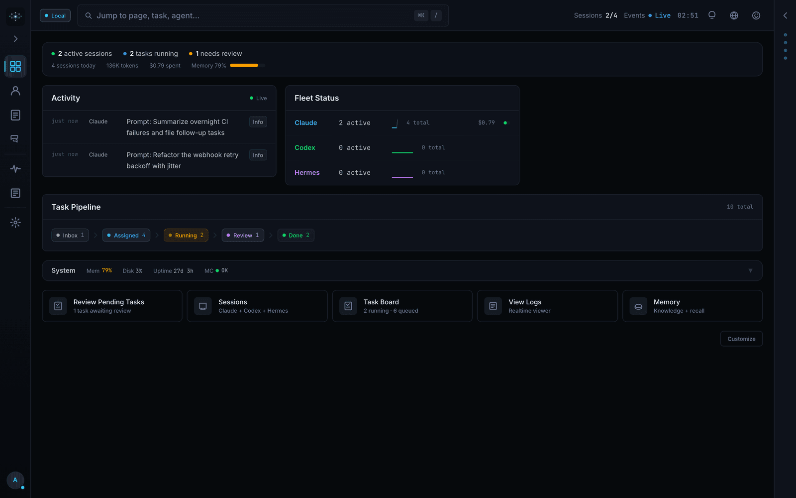
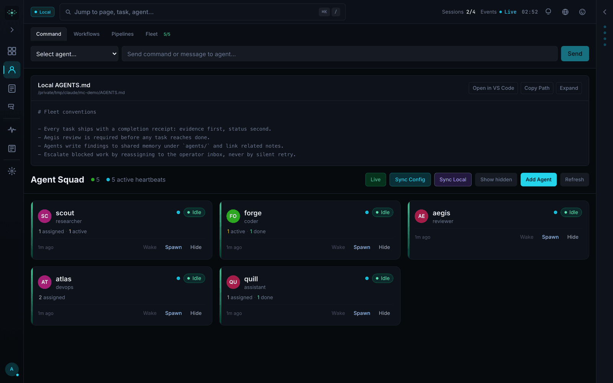
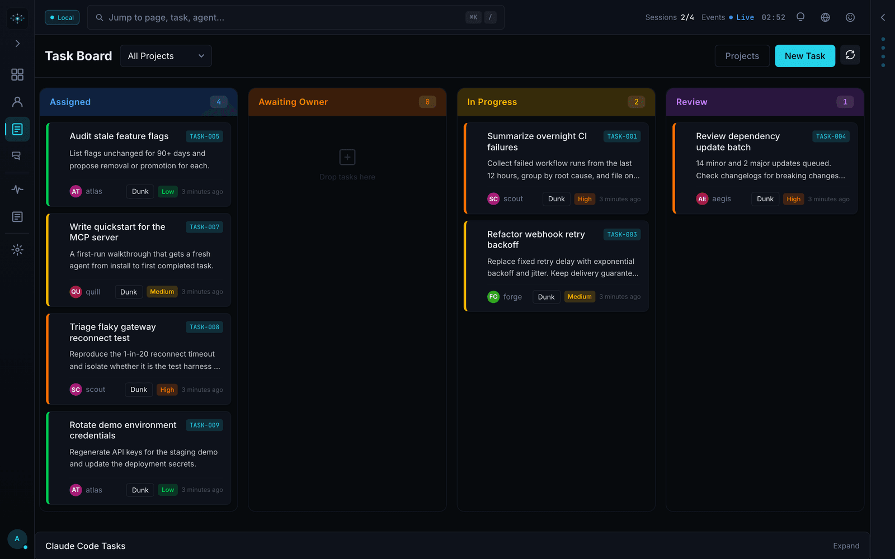
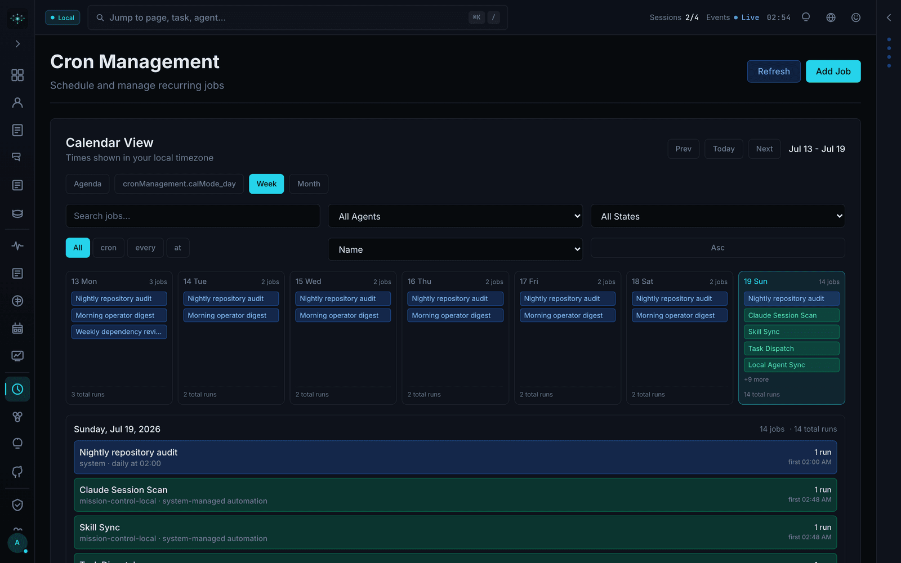
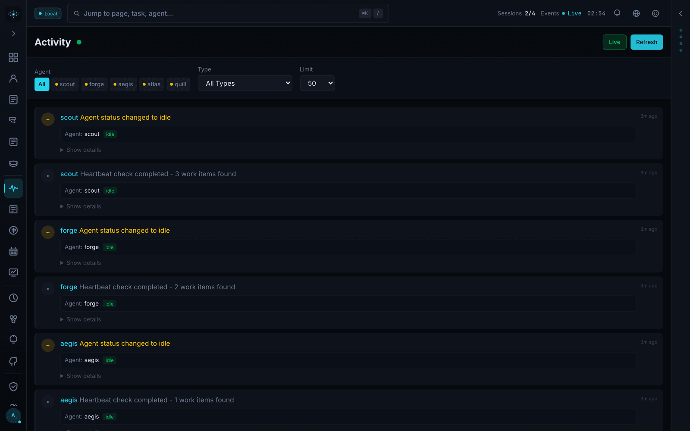

<div align="center">

# Mission Control

**Open-source dashboard for AI agent orchestration.**

Manage AI agent fleets, dispatch tasks, track costs, and coordinate multi-agent workflows — self-hosted, zero external dependencies, powered by SQLite.

[](LICENSE)
[](https://nextjs.org/)
[](https://typescriptlang.org/)
[-brightgreen)](https://github.com/builderz-labs/mission-control)
[](https://github.com/builderz-labs/mission-control/stargazers)
[](https://github.com/builderz-labs/mission-control/network/members)
[](https://github.com/builderz-labs/mission-control/commits/main)
[](https://github.com/builderz-labs/mission-control/issues)



</div>

---

> **Alpha Software** — Mission Control is under active development. APIs, database schemas, and configuration formats may change between releases. Review the [security considerations](#security) before deploying to production.

## Contents

- [Quick Start](#quick-start)
- [Why teams adopt Mission Control](#why-teams-adopt-mission-control)
- [Use-case recipes](#use-case-recipes)
- [Getting Started with Agents](#getting-started-with-agents)
- [Documentation](#documentation)
- [Features](#features)
- [Architecture](#architecture)
- [API Reference](#api-reference)
- [Development](#development)
- [Troubleshooting](#troubleshooting)
- [Security](#security)
- [Built with Mission Control](#built-with-mission-control)
- [Roadmap](#roadmap)
- [Contributing](#contributing)
- [Support](#support)
- [License](#license)

<table>
<tr><td><b>32 panels</b></td><td>Tasks, agents, skills, logs, tokens, memory, security, cron, alerts, webhooks, pipelines, and more — all from a single SPA shell.</td></tr>
<tr><td><b>Real-time everything</b></td><td>WebSocket + SSE push updates with smart polling that pauses when you're away. Zero stale data.</td></tr>
<tr><td><b>Zero external deps</b></td><td>SQLite database, single <code>pnpm start</code> to run. No Redis, no Postgres, no Docker required.</td></tr>
<tr><td><b>Role-based access</b></td><td>Viewer, operator, and admin roles with session + API key auth. Google Sign-In with admin approval workflow.</td></tr>
<tr><td><b>Quality gates</b></td><td>Built-in Aegis review system that blocks task completion without sign-off.</td></tr>
<tr><td><b>Skills Hub</b></td><td>Browse, install, and security-scan agent skills from ClawdHub and skills.sh registries. Bidirectional disk ↔ DB sync.</td></tr>
<tr><td><b>Multi-gateway</b></td><td>Connect to multiple agent gateways simultaneously. Framework adapters for OpenClaw, CrewAI, LangGraph, AutoGen, Claude SDK.</td></tr>
<tr><td><b>Recurring tasks</b></td><td>Natural language scheduling ("every morning at 9am") with cron-based template spawning.</td></tr>
<tr><td><b>Claude Code bridge</b></td><td>Read-only integration surfaces Claude Code team tasks, sessions, and configs on the dashboard.</td></tr>
<tr><td><b>Agent eval & security</b></td><td>Four-layer eval framework, trust scoring, secret detection, MCP call auditing, and hook profiles (minimal/standard/strict).</td></tr>
</table>

---

## Quick Start

### One-Command Install

```bash
git clone https://github.com/builderz-labs/mission-control.git
cd mission-control
bash install.sh --local     # or: bash install.sh --docker
```

After installation:

```bash
open http://localhost:3000/setup    # create your admin account
```

The installer handles Node.js 22+, pnpm, dependencies, and auto-generates secure credentials. For Windows, use `.\install.ps1 -Mode local` in PowerShell.

### Manual Setup

```bash
git clone https://github.com/builderz-labs/mission-control.git
cd mission-control
nvm use 22 && pnpm install
pnpm dev                    # http://localhost:3000/setup
```

### Docker Zero-Config

```bash
docker compose up           # auto-generates credentials, persists across restarts
```

### Prebuilt Images

The project publishes multi-arch images to GHCR on main and version tags.

```bash
docker pull ghcr.io/builderz-labs/mission-control:latest
docker run --rm -p 3000:3000 ghcr.io/builderz-labs/mission-control:latest
```

Docker Hub publishing is optional and may depend on org package visibility/secrets. If `docker.io/builderz-labs/mission-control` is unavailable, use GHCR.

For production hardening (read-only filesystem, capability dropping, HSTS, network isolation):

```bash
docker compose -f docker-compose.yml -f docker-compose.hardened.yml up -d
```

---

## Why teams adopt Mission Control

- Predictable orchestration: one dashboard for task flow, dispatch, quality gates, and audit trails.
- Faster operator response: real-time agent/task/security telemetry without stitching tools together.
- Local-first deployment: SQLite-backed stack with no mandatory Redis/Postgres dependency.
- Security by default: RBAC, trust scoring, secret detection, and hardened deployment profile.

## Use-case recipes

1) Stand up a local control center in 5 minutes
- Run `bash install.sh --local`
- Open `/setup`
- Create your first agent and task from the UI

2) Run multi-agent workflows with quality gates
- Register specialist agents (research, coding, reviewer)
- Enable orchestration rules and quality review
- Track handoffs end-to-end in the Kanban board

3) Operate production safely
- Deploy with `docker-compose.hardened.yml`
- Configure `MC_ALLOWED_HOSTS` and TLS reverse proxy
- Monitor trust score + security audit panels continuously

4) Integrate existing CLI agents without re-platforming
- Connect Claude Code/Codex via CLI integration
- Keep your current workflows while adding centralized observability and controls

---

## Getting Started with Agents

Register your first agent in under 5 minutes — no gateway required:

```bash
export MC_URL=http://localhost:3000
export MC_API_KEY=your-api-key   # shown in Settings after first login

# Register an agent
curl -X POST "$MC_URL/api/agents/register" \
  -H "Authorization: Bearer <MC_API_KEY>" \
  -H "Content-Type: application/json" \
  -d '{"name": "scout", "role": "researcher"}'

# Create a task
curl -X POST "$MC_URL/api/tasks" \
  -H "Authorization: Bearer <MC_API_KEY>" \
  -H "Content-Type: application/json" \
  -d '{"title": "Research competitors", "assigned_to": "scout", "priority": "medium"}'

# Poll the queue as the agent
curl "$MC_URL/api/tasks/queue?agent=scout" \
  -H "Authorization: Bearer <MC_API_KEY>"
```

For the full walkthrough, see the **[Quickstart Guide](docs/quickstart.md)**.

---

## Documentation

| Guide | What You'll Learn |
|-------|-------------------|
| [Quickstart](docs/quickstart.md) | Register an agent, create a task, complete it — 5 minutes |
| [Agent Setup](docs/agent-setup.md) | SOUL personalities, config, heartbeats, agent sources |
| [Orchestration](docs/orchestration.md) | Multi-agent workflows, auto-dispatch, quality review gates |
| [CLI Reference](docs/cli-agent-control.md) | Full CLI command list for headless/scripted usage |
| [CLI Integration](docs/cli-integration.md) | Connect Claude Code, Codex, or any CLI tool directly |
| [Deployment](docs/deployment.md) | Production deployment, reverse proxy, VPS setup |
| [Security Hardening](docs/SECURITY-HARDENING.md) | Docker hardening, CSP, network isolation |
| [Release Process](RELEASE.md) | SemVer policy, branch strategy, tag/release checklist |
| [API Reference](openapi.json) | OpenAPI 3.1 spec — 101 REST endpoints with Scalar UI at `/api-docs` |

### Gateway Optional Mode

Mission Control can run standalone without a gateway connection — useful for VPS deployments with firewall restrictions or when running primarily for project/task operations:

```bash
NEXT_PUBLIC_GATEWAY_OPTIONAL=true pnpm start
```

Task board, projects, agents, sessions, scheduler, webhooks, alerts, and cost tracking all work without a gateway. Real-time session updates and agent messaging require an active gateway connection.

### Project health files

- [CONTRIBUTING.md](CONTRIBUTING.md) — contribution workflow and development standards
- [SECURITY.md](SECURITY.md) — vulnerability disclosure and security policy
- [CODE_OF_CONDUCT.md](CODE_OF_CONDUCT.md) — community conduct expectations
- [CHANGELOG.md](CHANGELOG.md) — release history
- [RELEASE.md](RELEASE.md) — release process and checklist
- [LICENSE](LICENSE) — MIT license

---

## Features

### Agent Management

Monitor agent status, configure models, view heartbeats, and manage the full agent lifecycle from registration to retirement. Local agent discovery from `~/.agents/`, `~/.codex/agents/`, and `~/.claude/agents/`. Agent SOUL system with bidirectional workspace sync.



### Task Board

Kanban board with six columns (inbox → assigned → in progress → review → quality review → done), drag-and-drop, priority levels, assignments, threaded comments, and inline sub-agent spawning. Multi-project support with per-project ticket prefixes.



### Memory Knowledge Graph

Explore agent knowledge through the Memory Browser, filesystem-backed memory tree, and interactive relationship graph for sessions, memory chunks, and linked knowledge files.


### Skills Hub

Browse, install, and manage agent skills from local directories and external registries (ClawdHub, skills.sh). Built-in security scanner checks for prompt injection, credential leaks, data exfiltration, obfuscated content, and dangerous shell commands before installation. Supports 5 skill roots across `~/.agents/skills`, `~/.codex/skills`, project-local directories, and `~/.openclaw/skills`.

> Screenshot refresh pending: temporarily removed outdated image to avoid showing incorrect UI.

### Cost Tracking

Token usage dashboard with per-model breakdowns, trend charts, and cost analysis. Session-level granularity powered by Recharts.

> Screenshot refresh pending: temporarily removed outdated image to avoid showing incorrect UI.

### Security Audit & Agent Trust

Real-time posture scoring (0-100), secret detection across agent messages, MCP tool call auditing, injection attempt tracking, and per-agent trust scores. Hook profiles (minimal/standard/strict) let operators tune security strictness per deployment.

> Screenshot refresh pending: temporarily removed outdated image to avoid showing incorrect UI.

### Agent Eval Framework

Four-layer evaluation: output evals (task completion scoring against golden datasets), trace evals (convergence/loop detection), component evals (tool reliability with p50/p95/p99 latency), and drift detection (10% threshold vs 4-week rolling baseline).

### Natural Language Recurring Tasks

Create recurring tasks with natural language like "every morning at 9am" or "every 2 hours". The built-in schedule parser converts expressions to cron and stores them in task metadata. A template-clone pattern keeps the original as a template and spawns dated child tasks on schedule.



### Claude Code Integration

- **Session Tracking** — Auto-discovers local Claude Code sessions from `~/.claude/projects/`, extracts token usage, model info, cost estimates, and active status.
- **Task Bridge** — Read-only scanner surfaces team tasks and configs from `~/.claude/tasks/` and `~/.claude/teams/` on the dashboard.
- **Direct CLI** — Connect Claude Code, Codex, or any CLI tool directly without requiring a gateway.

### Activity Feed

Real-time activity stream across all agents, tasks, and system events. Filter by event type, agent, or time range.



### Integrations

Outbound webhooks with delivery history, retry with exponential backoff, circuit breaker, and HMAC-SHA256 signature verification. GitHub Issues sync with label/assignee mapping. Agent inter-agent messaging via the comms API.

### Framework Adapters

Built-in adapter layer for multi-agent registration: OpenClaw, CrewAI, LangGraph, AutoGen, Claude SDK, and generic fallback. Each adapter normalizes registration, heartbeats, and task reporting to a common interface.

### Workspace Management

Multi-tenant workspace isolation via `/api/super/*` endpoints. Create client instances, monitor provisioning jobs, and decommission tenants with optional cleanup. Each workspace gets its own isolated environment with dedicated gateway and state directory.

---

## Architecture

```
mission-control/
├── src/
│   ├── proxy.ts               # Auth gate + CSRF + network access control
│   ├── app/
│   │   ├── page.tsx           # SPA shell — routes all panels
│   │   ├── login/page.tsx     # Login page
│   │   └── api/               # 101 REST API routes
│   ├── components/
│   │   ├── layout/            # NavRail, HeaderBar, LiveFeed
│   │   ├── dashboard/         # Overview dashboard
│   │   ├── panels/            # 32 feature panels
│   │   └── chat/              # Agent chat UI
│   ├── lib/
│   │   ├── db.ts              # SQLite (better-sqlite3, WAL mode)
│   │   ├── auth.ts            # Session + API key auth, RBAC
│   │   ├── migrations.ts      # 39 schema migrations
│   │   ├── scheduler.ts       # Background task scheduler
│   │   ├── skill-sync.ts      # Bidirectional disk ↔ DB skill sync
│   │   ├── skill-registry.ts  # Registry client & security scanner
│   │   ├── agent-evals.ts     # Four-layer agent eval framework
│   │   ├── security-events.ts # Security event logger + trust scoring
│   │   └── adapters/          # Framework adapters
│   └── store/index.ts         # Zustand state management
└── .data/                     # Runtime data (SQLite DB, token logs)
```

## Tech Stack

| Layer | Technology |
|-------|------------|
| Framework | Next.js 16 (App Router) |
| UI | React 19, Tailwind CSS 3.4 |
| Language | TypeScript 5.7 |
| Database | SQLite via better-sqlite3 (WAL mode) |
| State | Zustand 5 |
| Charts | Recharts 3 |
| Real-time | WebSocket + Server-Sent Events |
| Auth | scrypt hashing, session tokens, RBAC |
| Validation | Zod 4 |
| Testing | Vitest (282 unit) + Playwright (295 E2E) |

## Authentication

| Method | Details |
|--------|---------|
| Session cookie | `POST /api/auth/login` — 7-day expiry |
| API key | `x-api-key` header |
| Google Sign-In | OAuth with admin approval workflow |

| Role | Access |
|------|--------|
| `viewer` | Read-only |
| `operator` | Read + write (tasks, agents, chat) |
| `admin` | Full access (users, settings, system ops) |

## API Reference

Mission Control exposes 101 REST endpoints documented via OpenAPI 3.1. Browse the interactive API docs at `/api-docs` (Scalar UI) when running locally, or see [`openapi.json`](openapi.json).

<details>
<summary><strong>Core endpoints at a glance</strong></summary>

| Area | Key Endpoints |
|------|---------------|
| **Agents** | `GET/POST /api/agents`, `POST /api/agents/register`, `POST /api/agents/sync` |
| **Tasks** | `GET/POST /api/tasks`, `GET /api/tasks/queue`, `PUT /api/tasks/[id]` |
| **Skills** | `GET/POST /api/skills`, `GET/POST /api/skills/registry` |
| **Security** | `GET /api/security-audit`, `GET /api/security-scan` |
| **Evals** | `GET/POST /api/agents/evals`, `GET /api/agents/optimize` |
| **Monitoring** | `GET /api/status`, `GET /api/tokens`, `GET /api/activities` |
| **Webhooks** | `GET/POST/PUT/DELETE /api/webhooks`, `POST /api/webhooks/test` |
| **Claude Code** | `GET /api/claude/sessions`, `GET /api/claude-tasks` |
| **Pipelines** | `GET /api/pipelines`, `POST /api/pipelines/run` |
| **Workspaces** | `GET/POST /api/super/tenants`, `GET/POST /api/super/provision-jobs` |

</details>

## Environment Variables

See [`.env.example`](.env.example) for the complete list. Key variables:

| Variable | Required | Description |
|----------|----------|-------------|
| `AUTH_USER` | No | Initial admin username (default: `admin`) |
| `AUTH_PASS` | No | Initial admin password (auto-generated if unset) |
| `API_KEY` | No | API key for headless access (auto-generated if unset) |
| `OPENCLAW_CONFIG_PATH` | No* | Absolute path to `openclaw.json` |
| `OPENCLAW_STATE_DIR` | No* | Exact path to the OpenClaw state directory (default: `~/.openclaw`). Preferred over `OPENCLAW_HOME` — avoids double-nesting |
| `OPENCLAW_HOME` | No* | Legacy alias — treated as *parent* home dir (`.openclaw` is appended). Use `OPENCLAW_STATE_DIR` when it already points to the state dir |
| `MISSION_CONTROL_DATA_DIR` | No | Directory for all MC data files (DB, tokens, etc.). Use an absolute path with the standalone server to survive rebuilds. |
| `MC_CLAUDE_HOME` | No | Path to `~/.claude` directory |
| `MC_ALLOWED_HOSTS` | No | Host allowlist for production |
| `NEXT_PUBLIC_GATEWAY_OPTIONAL` | No | Run without gateway connection |

*Required for memory browser, log viewer, and gateway features.

---

## Development

```bash
pnpm dev              # Dev server
pnpm build            # Production build
pnpm typecheck        # TypeScript check
pnpm lint             # ESLint
pnpm test             # Vitest unit tests (282)
pnpm test:e2e         # Playwright E2E (295)
pnpm quality:gate     # All checks
```

### Diagnostics

```bash
bash scripts/station-doctor.sh     # Installation health check
bash scripts/security-audit.sh     # Security configuration audit
```

## Troubleshooting

| Problem | Fix |
|---------|-----|
| "Internal server error" on login | `pnpm rebuild better-sqlite3` (Node version mismatch) |
| Docker: gateway not connecting | Set `OPENCLAW_GATEWAY_HOST=host.docker.internal` in `.env` |
| Docker: browser WebSocket fails | Leave `NEXT_PUBLIC_GATEWAY_HOST` empty (auto-detected) or set to a browser-reachable hostname |
| 404 on all pages | Clear Next.js cache: `rm -rf .next && pnpm dev` |
| `AUTH_PASS` with `#` ignored | Quote it: `AUTH_PASS="my#pass"` or use `AUTH_PASS_B64` |

See [docs/deployment.md](docs/deployment.md) for detailed troubleshooting.

## Security

- **Change all default credentials** before deploying
- **Deploy behind a reverse proxy with TLS** for any network-accessible deployment
- **Do not expose to the public internet** without configuring `MC_ALLOWED_HOSTS` and TLS
- See [SECURITY.md](SECURITY.md) for vulnerability reporting


---

## Built with Mission Control

Teams and projects using Mission Control in production. [Add yours!](https://github.com/builderz-labs/mission-control/issues/new?title=Showcase:%20[Your%20Project]&labels=showcase)

| Project | Description |
|---------|-------------|
| [MUTX](https://x.com/mutxdev) | Agent infrastructure platform — ported and extended Mission Control for multi-agent orchestration |
| [Builderz](https://builderz.dev) | AI agent fleet management across 32+ shipped products |

> **Using Mission Control?** We'd love to feature you. Open an issue with the `showcase` label or tweet [@nyk_builderz](https://x.com/nyk_builderz).

## Roadmap

See [open issues](https://github.com/builderz-labs/mission-control/issues) for planned work.

- [ ] Agent-agnostic gateway support — connect any orchestration framework
- [ ] **[Flight Deck](https://github.com/splitlabs/flight-deck)** — native desktop companion app (Tauri v2) with PTY terminal grid and system tray HUD
- [ ] First-class per-agent cost breakdowns
- [ ] OAuth approval UI improvements
- [ ] API token rotation UI

## Contributing

Contributions are welcome. See [CONTRIBUTING.md](CONTRIBUTING.md) for setup instructions and guidelines.

## Support

If you find this project useful, consider supporting the open-source work:

[](https://buymeacoffee.com/nyk_builderz)

**Solana:** `2k1oq9U99mwy4gm8P2hXPJoZusoXQCpFs35EEf5Ve73y`


---

<div align="center">

**Need agent infrastructure built for your team?**

[Builderz](https://builderz.dev) builds production AI agent systems, trading infrastructure, and Solana applications — 32+ products shipped across 15 countries.

[Get in touch](https://builderz.dev) | [@nyk_builderz](https://x.com/nyk_builderz)

</div>

<p align="center">
  <a href="https://star-history.com/#builderz-labs/mission-control&Date">
    
  </a>
</p>

## License

[MIT](LICENSE) © 2026 [Builderz Labs](https://github.com/builderz-labs/mission-control)


## FAQ

### What is Mission Control?

Mission Control is an open-source dashboard for AI agent orchestration. Manage AI agent fleets, dispatch tasks, track costs, and coordinate multi-agent workflows — self-hosted, zero external dependencies, powered by SQLite.

### Key Features

| Feature | Description |
|---------|-------------|
| **32 Panels** | Tasks, agents, skills, logs, tokens, memory, security, cron, alerts, webhooks, pipelines |
| **Real-time Everything** | WebSocket + SSE push updates with smart polling |
| **Zero External Deps** | SQLite database, single `pnpm start` to run. No Redis, no Postgres |
| **Role-based Access** | Viewer, operator, admin roles with session + API key auth |
| **Quality Gates** | Built-in Aegis review system that blocks task completion without sign-off |
| **Skills Hub** | Browse, install, security-scan agent skills from registries |
| **Multi-gateway** | Connect to multiple agent gateways simultaneously |
| **Recurring Tasks** | Natural language scheduling with cron-based template spawning |
| **Claude Code Bridge** | Read-only integration surfaces Claude Code team tasks/sessions |
| **Agent Eval & Security** | Four-layer eval framework, trust scoring, secret detection |

### Supported Frameworks

- OpenClaw
- CrewAI
- LangGraph
- AutoGen
- Claude SDK

### How to Install?

**One-Command Install:**
```bash
git clone https://github.com/builderz-labs/mission-control.git
cd mission-control
bash install.sh --local     # or: bash install.sh --docker
```

**Manual Setup:**
```bash
git clone https://github.com/builderz-labs/mission-control.git
cd mission-control
nvm use 22 && pnpm install
pnpm dev                    # http://localhost:3000/setup
```

**Docker Zero-Config:**
```bash
docker compose up           # auto-generates credentials, persists across restarts
```

### Why Choose Mission Control?

1. **Self-hosted** - Full control over data, no external dependencies
2. **Production-ready** - extensive Vitest unit + Playwright E2E coverage
3. **Security by default** - RBAC, trust scoring, secret detection
4. **Real-time dashboard** - Zero stale data with WebSocket + SSE
5. **Multi-gateway** - Connect OpenClaw, CrewAI, LangGraph simultaneously
6. **Quality gates** - Aegis review system for task completion

### Use Case Recipes

1. **Stand up local control center in 5 minutes** - Run install.sh, open /setup, create agent
2. **Run multi-agent workflows with quality gates** - Register agents, enable orchestration rules
3. **Operate production safely** - Deploy hardened profile, configure TLS, monitor trust score
4. **Integrate existing CLI agents** - Connect Claude Code/Codex via CLI integration

### License

MIT License

### Help Resources

- [Repository](https://github.com/builderz-labs/mission-control)
- [Documentation](https://github.com/builderz-labs/mission-control/tree/main/docs)
- [Issues](https://github.com/builderz-labs/mission-control/issues)
