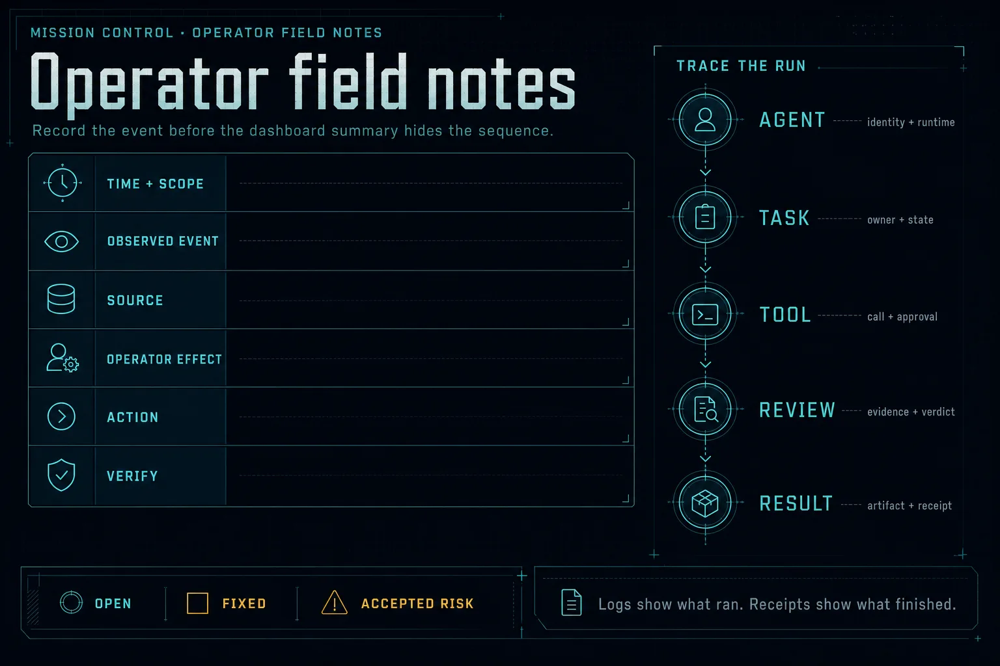
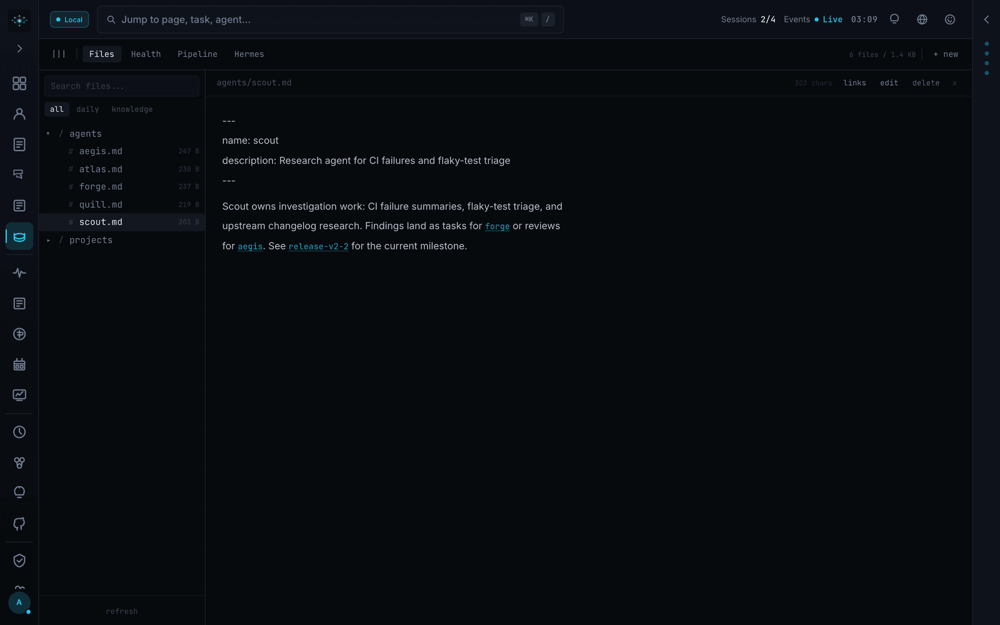

<div align="center">

# Mission Control

Self-hosted control plane for operating AI agents.

Dispatch tasks, inspect runs, review failures, track spend, and coordinate agent runtimes
from one local dashboard backed by SQLite.

[](https://github.com/builderz-labs/mission-control/actions/workflows/quality-gate.yml)
[](https://github.com/builderz-labs/mission-control/releases)
[](LICENSE)


</div>

> [!WARNING]
> Mission Control is alpha software. APIs, schemas, and configuration may change between
> releases. Read the [security guidance](#security-boundary) before exposing it to a network.

## Start locally

Node.js 22 or newer and pnpm are required for a source install.

```bash
git clone https://github.com/builderz-labs/mission-control.git
cd mission-control
bash install.sh --local
```

Open `http://localhost:3000/setup`, create the first admin account, then copy the API key
from Settings if an agent or script needs headless access.

The manual path is useful when you already manage Node and pnpm:

```bash
nvm use 22
pnpm install
pnpm dev
```

Windows users can run `./install.ps1 -Mode local` in PowerShell.

### Start with Docker

```bash
docker compose up
```

Or run the published multi-architecture image:

```bash
docker pull ghcr.io/builderz-labs/mission-control:latest
docker run --rm -p 3000:3000 ghcr.io/builderz-labs/mission-control:latest
```

Use the hardened Compose overlay for a network-accessible deployment:

```bash
docker compose -f docker-compose.yml -f docker-compose.hardened.yml up -d
```

The [deployment guide](docs/deployment.md) covers persistent data, TLS termination,
gateway connectivity, and standalone builds.

## What Mission Control governs

The control plane sits above agent runtimes. It does not replace their reasoning or tool
loops. It gives operators one place to see and govern the work around those loops.

| Area | Shipped surface |
|---|---|
| Tasks | Inbox, assignment, execution, review, Aegis quality gate, and completion receipts |
| Agents | Registration, presence, sessions, runtime adapters, configuration, and workspace sync |
| Operations | Activity stream, schedules, alerts, webhooks, logs, token use, and cost views |
| Knowledge | Memory browser, relationship graph, skills registry, and local skill synchronization |
| Governance | Roles, API keys, security events, trust signals, approvals, audits, and evals |
| Interfaces | Web UI, CLI, MCP server, OpenAPI-described REST API, WebSocket, and SSE |

The runtime is self-hosted and workspace-aware. SQLite stores local control-plane state.
Shared workspaces can use deployment-level runtime integrations. Strict workspaces block
those integrations until the underlying resources carry workspace ownership. A gateway is
optional for task, project, agent, scheduler, webhook, alert, and cost work; live session
messaging needs a connected runtime gateway.

## Operator field notes

Dashboards compress a sequence into current state. When a run needs review, record the
identity, task, tool call, approval, result, and verification evidence before changing it.
Keep unresolved items distinct from accepted risk.



Logs show what ran. A completion receipt or inspected artifact shows what finished.

## Pick the right fit

Use Mission Control when multiple agents or runtimes make it hard to answer who owns a
task, what executed, which result passed review, or where spend and failures accumulated.

It is probably the wrong tool when:

- one agent on one machine already stays understandable from its native CLI;
- you need a managed multi-tenant SaaS rather than a self-hosted control plane;
- you want an agent framework to define planning and tool use;
- your deployment cannot tolerate alpha schema or API changes.

Adapters and observation surfaces cover OpenClaw, Claude Code, Codex,
CrewAI, LangGraph, AutoGen, and Claude SDK workflows. Adapter depth varies by runtime; see
[agent setup](docs/agent-setup.md) and [CLI integration](docs/cli-integration.md) before
assuming feature parity.

## Connect an agent

The shortest gateway-free loop uses the REST API. Export the URL and API key shown in
Settings:

```bash
export MC_URL=http://localhost:3000
export MC_API_KEY=replace-with-your-api-key
```

Register an agent and create work:

```bash
curl -s -X POST "$MC_URL/api/agents/register" \
  -H "Authorization: Bearer $MC_API_KEY" \
  -H "Content-Type: application/json" \
  -d '{"name":"scout","role":"researcher"}'

curl -s -X POST "$MC_URL/api/tasks" \
  -H "Authorization: Bearer $MC_API_KEY" \
  -H "Content-Type: application/json" \
  -d '{"title":"Review open incidents","assigned_to":"scout","priority":"medium"}'
```

The agent can then claim its queue:

```bash
curl -s "$MC_URL/api/tasks/queue?agent=scout" \
  -H "Authorization: Bearer $MC_API_KEY"
```

Continue with the [first-agent quickstart](docs/quickstart.md) for heartbeats, task results,
queue behavior, CLI equivalents, and MCP setup.

### CLI

```bash
pnpm mc agents list --json
pnpm mc tasks queue --agent scout --json
pnpm mc events watch --types agent,task
```

### MCP server

```bash
claude mcp add mission-control -- \
  env MC_URL=http://127.0.0.1:3000 MC_API_KEY=replace-with-your-api-key \
  node /absolute/path/to/mission-control/scripts/mc-mcp-server.cjs
```

Use the [CLI and MCP reference](docs/cli-agent-control.md) for the current command and tool
surface. The REST contract lives in [`openapi.json`](openapi.json). A running instance serves
the interactive reference at `/docs` and the OpenAPI JSON at `/api/docs`.

## Product surfaces

### Tasks and quality review

The task board tracks work through inbox, assignment, execution, review, quality review,
and completion. Aegis review requires an approval record before a task reaches done.


### Agents and runtimes

Agent views combine registration state, heartbeats, sessions, configuration, local runtime
discovery, and workspace files.


### Memory and skills

The memory browser and relationship graph inspect filesystem-backed memory and linked
session knowledge. The Skills Hub discovers local skill roots and scans registry content
before installation.



### Schedules and activity

Recurring task templates create dated work on a cron schedule. The activity stream combines
agent, task, and system events for operator review.


## Documentation

| Guide | Use it for |
|---|---|
| [Quickstart](docs/quickstart.md) | Register an agent and run the first task loop |
| [Agent setup](docs/agent-setup.md) | Sources, identities, SOUL files, and heartbeats |
| [Orchestration](docs/orchestration.md) | Dispatch, handoffs, workflows, and review gates |
| [CLI and MCP](docs/cli-agent-control.md) | Headless commands and agent tools |
| [CLI integration](docs/cli-integration.md) | Claude Code, Codex, and gateway-free connections |
| [Deployment](docs/deployment.md) | Local, Docker, standalone, reverse proxy, and VPS setup |
| [Security hardening](docs/SECURITY-HARDENING.md) | Network, container, CSP, and secret controls |
| [Support](SUPPORT.md) | Questions, bugs, feature proposals, and security-report routing |
| [OpenClaw compatibility](docs/openclaw-config-compatibility.md) | Config and state-directory behavior |
| [Release process](RELEASE.md) | Versioning, tags, images, and release checks |

## Architecture

```text
Web UI ─┐
CLI ────┼── auth ─ dispatch ─ events ─ policy ─ receipts
MCP ────┤                                      │
REST ───┘                         SQLite + agent runtimes
```

| Layer | Technology |
|---|---|
| Application | Next.js 16 App Router, React 19, TypeScript 5 |
| Interface | Tailwind CSS 4, Zustand, Recharts, xterm.js |
| State | SQLite through better-sqlite3, with WAL mode |
| Boundaries | REST/OpenAPI, MCP, CLI, WebSocket, and SSE |
| Access | Session cookies, API keys, Google sign-in, and role checks |
| Validation | Zod at input boundaries |
| Verification | Vitest, Playwright, ESLint, TypeScript, build, and API parity checks |

Runtime data defaults to `.data/`. Set `MISSION_CONTROL_DATA_DIR` to an absolute persistent
path for standalone deployments. The complete environment contract is in
[`.env.example`](.env.example).

## Security boundary

- Keep Mission Control on a trusted network unless a TLS reverse proxy and
  `MC_ALLOWED_HOSTS` are configured.
- Replace or securely store generated credentials before broader access.
- Use the hardened Compose overlay for production-like container deployments.
- Treat agent messages, skill packages, webhooks, and MCP content as untrusted input.
- Report vulnerabilities through [SECURITY.md](SECURITY.md), not a public issue.

Access controls and security inspection surfaces are included, but alpha status
still applies. Read [SECURITY-HARDENING.md](docs/SECURITY-HARDENING.md) before relying on a
network-accessible deployment.

## Develop

```bash
pnpm install --frozen-lockfile
pnpm lint
pnpm typecheck
pnpm test
pnpm build
pnpm test:e2e
```

`pnpm quality:gate` runs the full repository gate. Useful diagnostics:

```bash
bash scripts/station-doctor.sh
bash scripts/security-audit.sh
pnpm api:parity
```

Common local failures:

| Symptom | Check |
|---|---|
| Login returns an internal error after changing Node versions | Run `pnpm rebuild better-sqlite3` |
| Docker cannot reach the gateway | Set `OPENCLAW_GATEWAY_HOST=host.docker.internal` |
| Browser WebSocket cannot connect | Leave `NEXT_PUBLIC_GATEWAY_HOST` empty or set a browser-reachable host |
| Password text after `#` disappears | Quote `AUTH_PASS` or use `AUTH_PASS_B64` |

See [CONTRIBUTING.md](CONTRIBUTING.md) for contribution scope, coding standards, and review
expectations. Community conduct is defined in [CODE_OF_CONDUCT.md](CODE_OF_CONDUCT.md).

## Project status and support

Release notes live in [CHANGELOG.md](CHANGELOG.md). Open issues are the current roadmap;
the project does not promise dates for unassigned work.

- Bugs and feature proposals: [GitHub Issues](https://github.com/builderz-labs/mission-control/issues)
- Vulnerabilities: [private reporting instructions](SECURITY.md)
- Builderz Labs: [builderz.dev](https://builderz.dev)
- Maintained by [Nyk](https://nyk.dev). [Sponsor ongoing development](https://github.com/sponsors/0xNyk) or follow [@nykdotdev](https://x.com/nykdotdev).

<p align="center">
  <picture>
    <source media="(prefers-color-scheme: dark)" srcset="docs/star-history-dark.svg">
    
  </picture>
</p>

## License

[MIT](LICENSE) © 2026 [Builderz Labs](https://github.com/builderz-labs)
